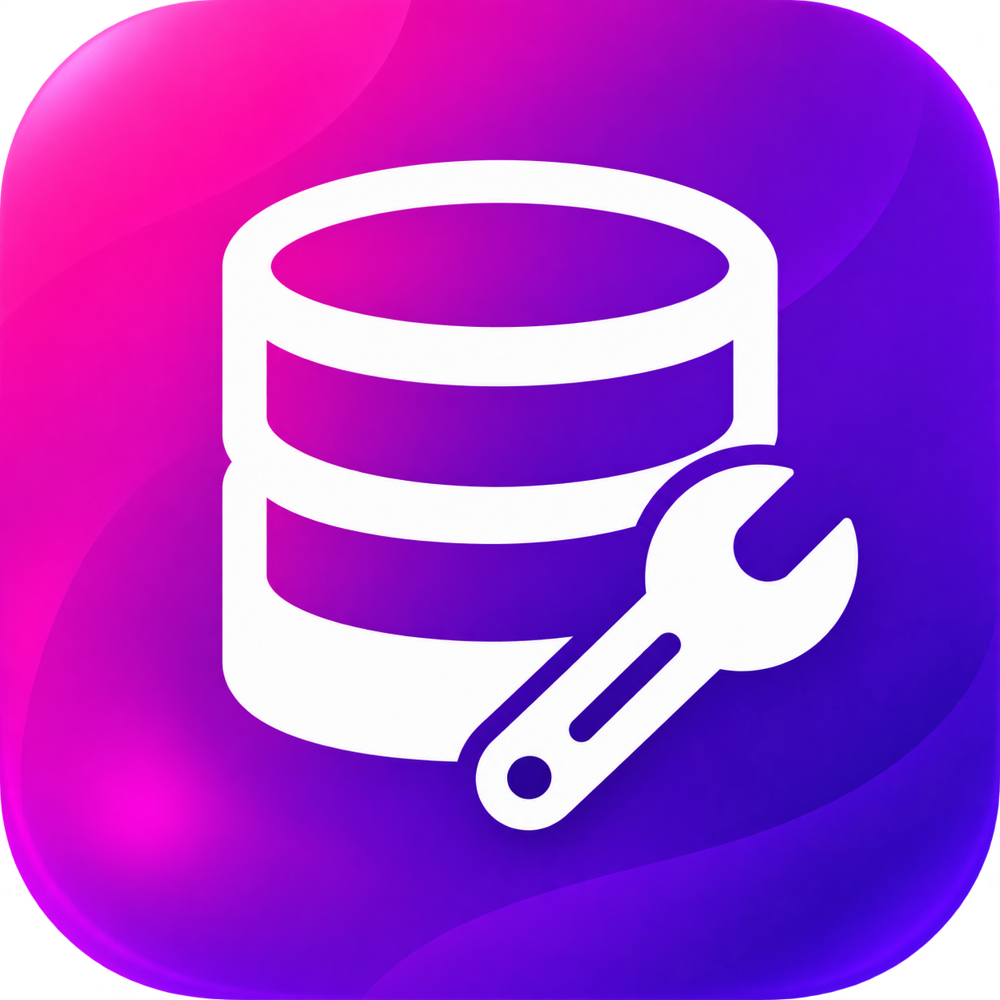

# Workbench



[](https://github.com/Gaucho-Racing/Workbench/actions/workflows/build.yml)
[](https://github.com/gaucho-racing/workbench/releases)
[](https://opensource.org/licenses/MIT)

Workbench is Gaucho Racing's in-house database management console.
It provides a browser-based PostgreSQL workspace for exploring database servers, inspecting schemas and DDL, running queries, and moving data without requiring every team member to configure a desktop database client.

Workbench integrates with [Sentinel](https://github.com/Gaucho-Racing/Sentinel) for authentication and group-based access control.
Members of `WorkbenchViewers` can inspect connected databases and run read-only queries, while members of `WorkbenchAdmins` can enable write mode, manage connections, and import or export data.

The application includes a multi-tab SQL editor, database discovery, schema diagrams, query history, CSV imports with preview and automatic table detection, and CSV, JSON, Parquet, and SQL exports.
Bulk exports include a `schema.sql` file containing the selected tables' DDL.

## Getting Started

### Prerequisites

- Docker with Docker Compose
- A Sentinel OAuth client configured with `http://localhost:10310/auth/login` as a redirect URI
- Membership in either `WorkbenchViewers` or `WorkbenchAdmins`

### Local Development

1. Clone the repository and enter the project directory.

   ```sh
   git clone https://github.com/Gaucho-Racing/Workbench.git
   cd Workbench
   ```

2. Create the local environment file.

   ```sh
   cp example.env .env
   ```

3. Set `SENTINEL_CLIENT_ID` and `SENTINEL_CLIENT_SECRET` in `.env` using the local Sentinel OAuth client credentials.

4. Start Workbench.

   ```sh
   docker compose up --build
   ```

5. Open [http://localhost:10310](http://localhost:10310).

The local stack runs the React frontend, Go API, Workbench metadata database, and Kerbecs gateway.
Embedded database migrations are applied automatically when the API starts.

### Configuration

| Variable | Description |
| --- | --- |
| `SENTINEL_URL` | Base URL of the Sentinel deployment. |
| `SENTINEL_CLIENT_ID` | Sentinel OAuth client ID used by the API and web application. |
| `SENTINEL_CLIENT_SECRET` | Sentinel OAuth client secret used for authorization-code exchange. |
| `SENTINEL_REDIRECT_URI` | OAuth callback URL registered with Sentinel. |
| `TARGET_ENCRYPTION_KEY` | Base64-encoded 32-byte key used to encrypt saved database credentials. |
| `QUERY_TIMEOUT` | Maximum duration of a query. Defaults to `30s`. |
| `QUERY_MAX_ROWS` | Maximum number of result rows returned to the browser. Defaults to `5000`. |
| `QUERY_MAX_BYTES` | Maximum result payload size in bytes. Defaults to `26214400`. |

Generate a production encryption key with:

```sh
openssl rand -base64 32
```

### Validation

```sh
cd web
npm ci
npm run lint
npm run build

cd ../workbench
go build ./...
go vet ./...
```

### Releases

Run the release script from a clean, up-to-date `main` branch:

```sh
./scripts/release.sh 1.2.0
```

The script updates the application version, creates the release commit, and publishes a GitHub release.
The release workflows publish multi-architecture `workbench-server` and `workbench-web` images to GitHub Container Registry, then open an infrastructure pull request with the new image tags.

## Contributing

If you have a suggestion that would make this better, please fork the repo and create a pull request. You can also open an issue with the tag `enhancement`.

1. Fork the Project
2. Create your Feature Branch (`git checkout -b gh-username/my-amazing-feature`)
3. Commit your Changes (`git commit -m 'Add my amazing feature'`)
4. Push to the Branch (`git push origin gh-username/my-amazing-feature`)
5. Open a Pull Request
